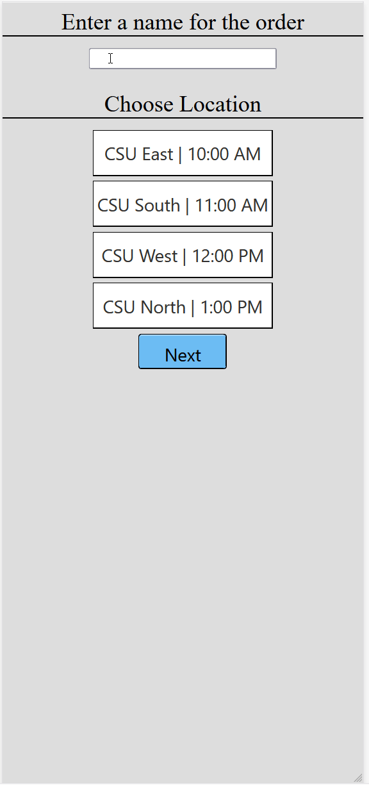
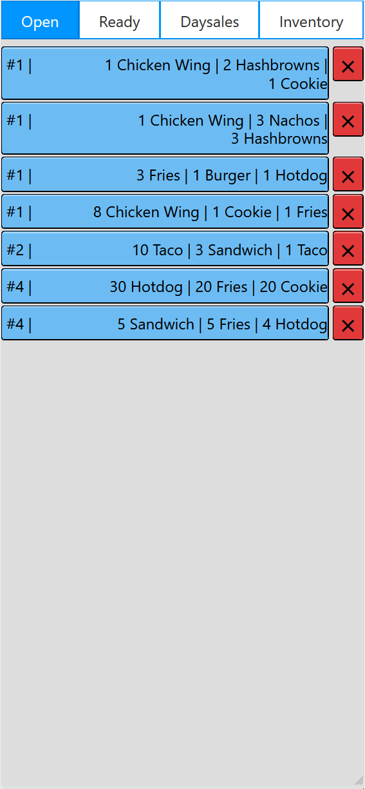

# Food Truck App with customer and seller interface that has dynamically generated content using MySQL database

This is a term final project I completed for a college class where I had to create food truck web application that has customer and seller interfaces that interact with each other.

* Created using PHP, JavaScript, HTML, CSS, and MySQL database
* Customer interface has customer name input, and dynamic location and item selection using database. Items can be added to cart and then the order can be submitted.
* Seller interface includes pages for open, ready, and completed orders. Each order button can be clicked to reveal additional order information. Each order has an X button to send it to change its status and send it to the next page.
* DaySales page shows ready and completed orders along with total orders and total sales for ready and completed orders.
* Inventory page allows for insert/update/delete items, and insert/update/delete locations.
* Inventory page allows for updating item stock. When items are created, deleted, out of stock, or stock updated, the inventory page and customer order page changes to reflect the current items in the database.

# Customer Interface Demo             |  # Seller Interface Demo
:-------------------------:|:-------------------------:
  | 
